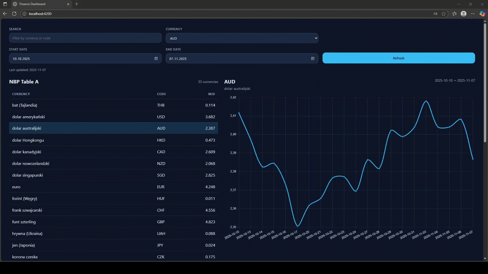

# Finance Dashboard



A responsive Angular 17 dashboard that visualizes currency exchange data from the Narodowy Bank Polski (NBP) public API. The app lists the latest FX rates (Table A), supports quick filtering, and renders interactive historical trends using Chart.js via `ng2-charts`.


## Getting Started


### Installation

```bash
npm install
```

### Development server

```bash
npm start
```

The app will be available at `http://localhost:4200/`. Angular's live reload is enabled by default.

### Production build

```bash
npm run build
```


